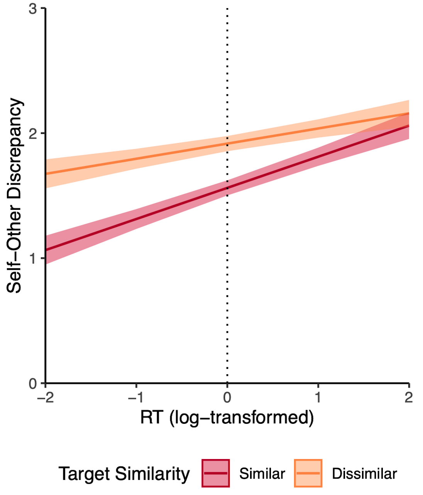

# Visualizing interaction effects in a multilevel model
Here is my annotated [code](https://github.com/yilinandrewang/visualizeMLM/blob/main/visualizeMLMinteract.R) to create this plot, which visualizes a level 1 (RT) by level 2 (Target Similarity) interaction.

